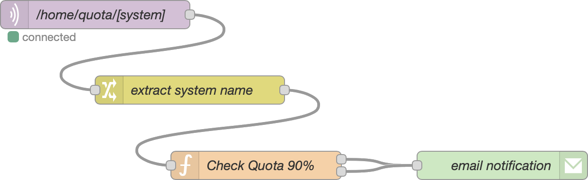

# Tutorial: Monitoring Storage Quotas

Running out of disk space on either your Raspberry Pi or your remote backup system (eg Dropbox) can prevent your backups from completing properly.

IOTstackBackup includes a convenience script which uses RCLONE to monitor the storage utilisation on both your Raspberry Pi and your RCLONE remote<sup>[†](#supportMatrix)</sup>.

Key point:

* This convenience script is specific to RCLONE. It does not work with either RSYNC or SCP.

## installation

The `iotstack_backup_quota_report` script is contained in the `scripts` folder and will be installed by `install_scripts.sh`.

## dependencies

The script relies on both `mosquitto_pub` and `rclone`. If those are not installed on your system, you will need to run either/both:

``` console
$ sudo apt install mosquitto-clients
$ curl https://rclone.org/install.sh | sudo bash
```

You may also need to follow the [*rclone* (Dropbox)](./README.md#rcloneOption) setup instructions to configure RCLONE.

## calling sequence

The script takes three optional arguments:

1. The name of your RCLONE remote. The default for this argument is "dropbox".

	This argument must be a name that appears when you ask RCLONE to list your remotes. For example:

	``` console
	$ rclone listremotes
	dropbox:
	```

	<a name="supportMatrix">†</a>&nbsp;RCLONE supports many kinds of remote. However, not every remote supports the "about" command which is used to determine space utilisation on the remote. There is a definitive list at [rclone.org](https://rclone.org/overview/#optional-features). The "About" column.
	
	You can also test whether your remote supports the feature like this:
	
	``` console
	$ rclone about dropbox:
	Total:   2.005 TiB
	Used:    122.058 GiB
	Free:    1.885 TiB
	```

	Note, the trailing colon on the remote name is:
	
	* *required* when you use the `rclone about` command; but
	* *omitted* when you invoke `iotstack_backup_quota_report`.
	
2. The MQTT topic prefix. The default is "/quota". The prefix is prepended to form the actual topic strings. For example:

	- `/quota/dropbox`
	- `/quota/iot-hub`
	
	In the first case, "dropbox" is the name of your RCLONE remote. In the second case, "iot-hub" is the name of the Raspberry Pi where the script is running.
	
3. The domain name or IP address of the host running your MQTT broker. Defaults to "127.0.0.1" on the assumption that Mosquitto is running in a local container.
4. The port number for your MQTT broker. Defaults to 1883.

## command line example

This example uses all arguments:

```
$ iotstack_backup_quota_report dropbox /home/quota mqtt.mydomain.com 1883
```

The resulting MQTT messages will have the following structure:

```
/home/quota/dropbox {  "total": 2204123529216,  "used": 141289520349,  "free": 2062834008867 } 
/home/quota/iot-hub {  "total": 472305868800,  "used": 16434315264,  "free": 436624248832 } 
```

The values are in bytes. Interpretation:

* The total account space on Dropbox is 2TB, of which 1.8TB remains unused.
* The storage space on the Raspberry Pi system (an SSD) is 440GB, of which 406GB remains unused.

## cron job example

The following `crontab` entry would run the above script at 6AM each day:

```
0    6    *    *    *    iotstack_backup_quota_report dropbox /home/quota mqtt.mydomain.com 1883
```

When invoked by `cron`, the script writes its output to:

```
~/Logs/iotstack_backup_quota_report.log
```

The log is normally empty but is the place to start looking if the `cron` job stops working.

## Node-RED flow example



Example code matching that flow can be found [here](./resources/quota-flow-example.json).

The *MQTT-In* node subscribes to the wildcard topic:

```
/home/quota/+
```

Continuing with the previous example, the flow would receive two messages:

- `/home/quota/dropbox`
- `/home/quota/iot-hub`

The *Change* node extracts the system name (ie `dropbox` or `iot-hub`) from the last component of the topic string and stores it in `msg.system`.

The *Function* node is a bare-bones implementation which checks for utilisation over a threshold value (90%) and constructs a very basic email message.

Where utilisation exceeds the threshold, the *Function* node exits via the upper outlet; the lower outlet otherwise.

> Both outlets are wired to the email notification in the example but you would typically only use that during testing. In normal use, disconnecting the lower outlet would result in an email only being sent when disk utilisation was above the threshold.

Fairly obviously, you can change this flow to send other kinds of notification (eg PushSafer) and/or log the metrics to an Influx database which you subsequently chart in Grafana.

